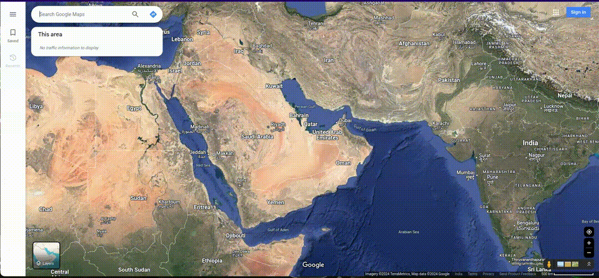
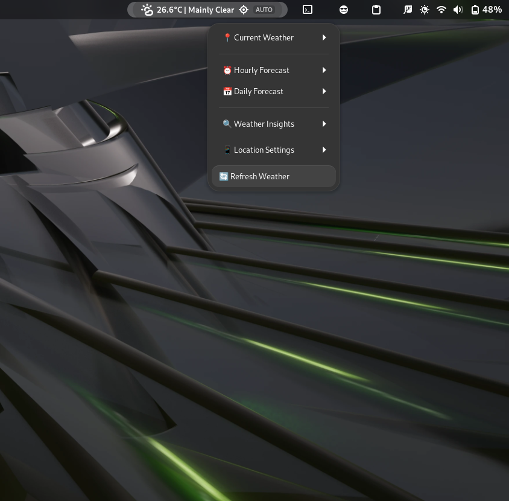

# Advanced Weather Companion GNOME Shell Extension

## Overview

Advanced Weather is a feature-rich GNOME Shell extension that provides detailed and customizable weather information right on your desktop. With support for multiple locations, advanced forecasting, and beautiful visualizations, this extension transforms how you interact with weather data.

## Features

- 🌦️ Real-time weather updates
- 📍Auto-location detection
- 🌡️ Detailed temperature and feels-like information
- 💨 Wind speed and direction
- 💧 Humidity and precipitation forecasts
- 🌈 Dynamic weather icons
- 🌐 Multiple weather data providers
- 🎨 Customizable appearance and units

## Installation

### From GNOME Extensions Website
1. Visit [GNOME Extensions](https://extensions.gnome.org/)
2. Search for "Advanced Weather Companion"
3. Toggle the switch to install

#### Manual installation

Install from source

- Download archive file from the releases tab
- Open a terminal in the directory containing the downloaded file
- Install and enable the extension by executing `gnome-extensions install extension.zip --force` in the terminal

> To setup your manual location by giving your location coordinates in the settings in the extension or in the Location settings in the main menu of the extension , you can get you location coordinates from the google map by going to your location and right clink on in it and coping the location coordinates from it by clicking them 

## Screenshots

### Weather Widget in home screen 

### Main Interface

### Hourly Forecast Interface

### Daily Forecast Interface

## Weather Insight Interface

## Features

- Real-time weather updates with current conditions
- Hourly and daily forecasts
- Smart weather insights with temperature trends and probability of precipitation
- Automatic location detection with an option to input coordinates manually
- Support for Celsius and Fahrenheit
- UI with animated elements for smoothness.

## Weather Data Display

- Current weather: Temperature, conditions, wind speed 

## Location settings

## Refresh button Interface

## Configuration
### Weather Widget configuration in settings

Right-click the weather widget to access:
- Location settings
- Unit preferences (Celsius/Fahrenheit)
- Update interval
- Weather provider selection

## Requirements

- GNOME Shell 45+
- Internet connection

## Troubleshooting

### Common Issues
- No weather data displayed
  - Click the refresh button 🔄
  - Check your internet connection 
  - Restart GNOME Shell (Alt+F2, then type 'r')

## Contributing

### Reporting Issues
- Check existing issues
- Provide detailed description
- Include GNOME Shell version
- Attach screenshots if possible

### Development
1. Fork repository
2. Create feature branch
3. Commit changes
4. Push and create Pull Request

## Uses 
This extension is using `ipapi.co` and `open-meteo.com` services

## License

MIT License - See [LICENSE](LICENSE) for details

## Donations

Support the development:

**Thank you for your support!**
# Please forgive me for my bad documentation 😅
  

**Star ⭐ my   repository if you find it useful!**
