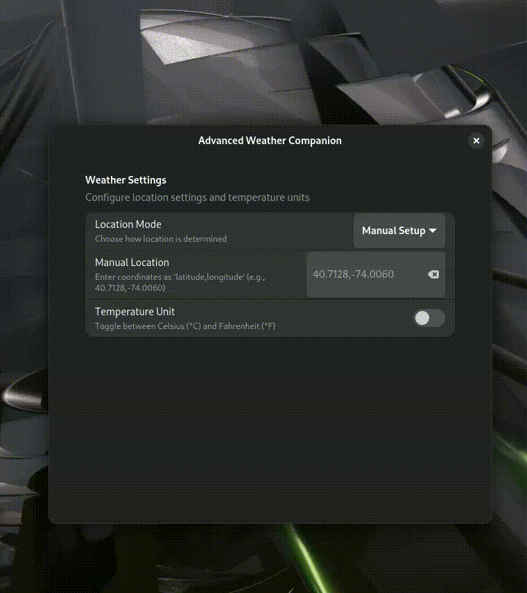

# Advanced Weather GNOME Shell Extension

## Overview

Advanced Weather is a feature-rich GNOME Shell extension that provides detailed and customizable weather information right on your desktop. With support for multiple locations, advanced forecasting, and beautiful visualizations, this extension transforms how you interact with weather data.



## Features

- 🌦️ Real-time weather updates
- 📍 Multi-location support
- 🌡️ Detailed temperature and feels-like information
- 💨 Wind speed and direction
- 💧 Humidity and precipitation forecasts
- 🌈 Dynamic weather icons
- 🌐 Multiple weather data providers
- 🎨 Customizable appearance and units

## Installation

### From GNOME Extensions Website
1. Visit [GNOME Extensions](https://extensions.gnome.org/)
2. Search for "Advanced Weather"
3. Toggle the switch to install

### Manual Installation
```bash
git clone https://github.com/yourusername/advanced-weather-extension.git
cd advanced-weather-extension
make install
```

## Screenshots

### Main Interface


### Configuration Panel


### Multiple Location Support


## Some screeshots of this extension 


## Configuration

Right-click the weather widget to access:
- Location settings
- Unit preferences (Celsius/Fahrenheit)
- Update interval
- Weather provider selection

## Requirements

- GNOME Shell 45+
- Internet connection
- One of the supported weather APIs:
  - OpenWeatherMap
  - WeatherAPI
  - AccuWeather

## Troubleshooting

### Common Issues
- No weather data displayed
  - Check internet connection
  - Verify API key
  - Restart GNOME Shell (Alt+F2, then type 'r')


## Contributing

### Reporting Issues
- Check existing issues
- Provide detailed description
- Include GNOME Shell version
- Attach screenshots if possible

### Development
1. Fork repository
2. Create feature branch
3. Commit changes
4. Push and create Pull Request

## Localization

Help translate Advanced Weather into your language! Check `po/` directory for translation files.

## License

MIT License - See [LICENSE](LICENSE) for details

## Donations

Support the development:
- [Buy me a Coffee](https://buymeacoffee.com/weatherextension)
  

## Credits

- Weather icons by [WeatherIcons](https://weathericons.org)
- Inspired by community feedback

## Changelog

### v2.3.0
- Added AccuWeather support
- Improved performance
- Bug fixes

---

**Star ⭐ the repository if you find it useful!**